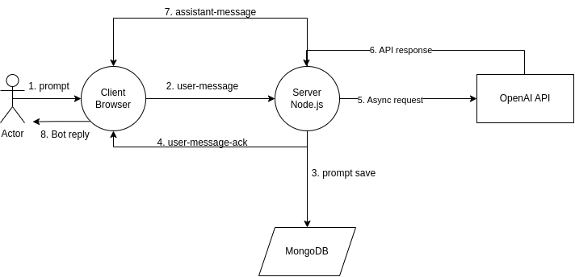

# Real-time Chatbot Web Application

A real-time chatbot application developed in Node.js with a React.js frontend using the Shadcn UI library. The application interfaces with OpenAI's API for natural language processing, utilizes Socket.io for real-time communication, and stores chat history in MongoDB.

## Features
1. User Interaction:

- Input box for users to submit messages to the chatbot.
- Real-time conversation updates using Socket.io.

2. Message View Container:

- Display of both user and bot messages in a visually appealing message view container.

3. OpenAI Integration:

- Asynchronous communication with the OpenAI API for natural language processing.
- Context-aware responses by sending at max three previous conversation messages to the OpenAI API.

4. Message Storage:

- Messages are stored in MongoDB for future reference.
- Fetch and display up to twenty previous conversation messages upon initial page load.

5. Validation:

- Frontend and backend validation for proper message formatting.

6. Loading Indicator:

- Disable the submit button during processing to prevent multiple submissions.
- Enable the submit button upon receiving a response from the chatbot.

## Flow

1. User sends a prompt through the input box triggering the 'user-message' socket event.
2. The server acknowledges the message with 'user-message-ack' and saves it in MongoDB
3. Initiate an asynchronous request to the OpenAI API for a response, considering the context from at most three previous messages.
4. The user's message is displayed in the message view container, and the submit button is disabled till the bot replies.
5. Upon receiving a response from OpenAI, the server saves it in MongoDB and sends an 'assistant-message' event.
6. The chatbot's response is displayed in the message view container, and the submit button becomes enabled.

## Architecture


This is a complete decoupled project that has separate `frontend` and `backend` folders.

To setup the project, clone the repo and follow the below instructions -

### Backend
Backend is powered by Node.js and MongoDB to make data persistent.

#### Setup
1. Navigate to `backend` directory
```
cd backend
```
2. Ensure you are using the proper Node.js version with:
```
nvm use
```
3. Install backend dependencies using:
```
npm install
```
4. Create a `.env` file with the necessary configuration values. A sample file, `.env.sample`, is provided for reference. You will need to obtain the OpenAI API key from [here](https://platform.openai.com/api-keys).
5. Launch the development server with:
```
npm start
```
Alternatively, to start without watching file changes, do
```
node index.js
```
The server will run on the port specified in the .env file.

### Frontend

#### Setup
1. 1. Navigate to `frontend` directory
```
cd frontend
```
2. Ensure you are using the proper Node.js version with:
```
nvm use
```
3. Install frontend dependencies using:
```
npm install
```
4. Create a `.env` file with the necessary configuration values. A sample file, `.env.sample`, is provided for reference.
5. Run the development server with:
```
npm run dev
```
To build the frontend, use:
```
npm run build
```
and to serve the build at localhost:3000 -
```
npm start
```

## REST API Endpoints

- **GET /conversation**
	Retrieve up to twenty conversation messages.
